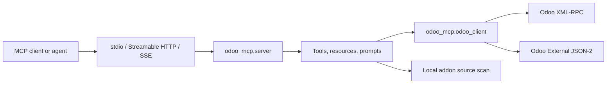
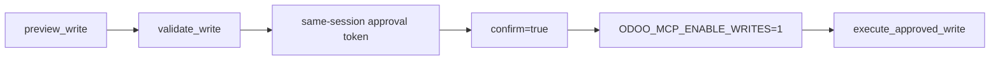

# Architecture

Odoo MCP is a thin MCP server around a deliberately small Odoo client. The design goal is simple: give agents high-signal Odoo context while keeping execution paths inspectable and bounded.

## System shape

## Main modules

| Module | Responsibility |
| --- | --- |
| `src/odoo_mcp/__main__.py` | CLI entry point, transport selection, HTTP bind safety, non-secret health output. |
| `src/odoo_mcp/server.py` | MCP server, tools, resources, prompts, safe write gates, runtime annotations. |
| `src/odoo_mcp/odoo_client.py` | Odoo connection, XML-RPC calls, JSON-2 calls, profile helpers. |
| `src/odoo_mcp/diagnostics.py` | Pure diagnostic helpers for Odoo call analysis, JSON-2 payloads, migration risk, fit/gap reports. |
| `src/odoo_mcp/agent_tools.py` | Pure agent helpers for safe writes, domain building, addon scanning, and business pack reports. |
| `scripts/odoo_compose_smoke.py` | Real Docker Compose smoke validation against disposable Odoo stacks. |

## Transport model

`stdio` is the default MCP transport. It is local, simple, and compatible with most MCP clients.

Streamable HTTP and SSE are opt-in. The CLI binds to `127.0.0.1` by default and rejects non-local binds unless the operator passes `--allow-remote-http` or sets `MCP_ALLOW_REMOTE_HTTP=1`.

HTTP allowlists such as `MCP_ALLOWED_HOSTS` and `MCP_ALLOWED_ORIGINS` are hardening controls, not authentication. Put remote deployments behind external auth and TLS.

## Odoo transport model

| Odoo version | Recommended transport | Notes |
| --- | --- | --- |
| 16.0 | XML-RPC | Default compatibility path. |
| 17.0 | XML-RPC | Default compatibility path. |
| 18.0 | XML-RPC | Default compatibility path. |
| 19.0 | JSON-2 or XML-RPC | JSON-2 is opt-in through `ODOO_TRANSPORT=json2`. |

JSON-2 uses bearer authentication and named JSON arguments. XML-RPC carries the database name per request; JSON-2 can receive `X-Odoo-Database` when `ODOO_JSON2_DATABASE_HEADER=1`.

## Safety boundaries

The server separates read, diagnosis, preview, validation, and execution.

Read and diagnostic tools do not execute candidate write methods. `execute_method` blocks direct `create`, `write`, and `unlink`. Unknown side-effect methods are blocked unless the deployment explicitly opts into reviewed custom methods with `ODOO_MCP_ALLOW_UNKNOWN_METHODS=1`.

The standard write path is:

`validate_write` stores an executable approval only when validation used trusted, non-empty live Odoo `fields_get` metadata. Client-provided or shape-only metadata can explain issues, but it does not authorize execution.

## Local addon scanning

`scan_addons_source` scans files from configured `ODOO_ADDONS_PATHS` roots without importing addon code. Explicit paths must live inside those configured roots. This keeps source inspection deterministic and avoids executing arbitrary addon imports.

## Runtime state

Approval tokens are process-local and short-lived. They are intended for one MCP server session, not durable queues or cross-process approvals.

No Odoo credentials are written by the server. Startup logs mask known secret environment variables.
